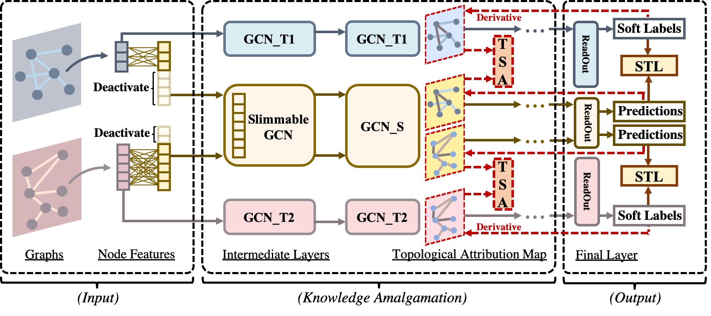

# PyTorch implementation of AmalgamateGNN

Paper: [Amalgamating Knowledge from Heterogeneous Graph Neural Networks](https://openaccess.thecvf.com/content/CVPR2021/papers/Jing_Amalgamating_Knowledge_From_Heterogeneous_Graph_Neural_Networks_CVPR_2021_paper.pdf), CVPR'21

## Method Overview



## Dependencies

See [requirements](requirements.txt) file for more information
about how to install the dependencies.

## Usage

### 1. Prerequisites

A pool of pre-trained teacher models for knowledge amalgamation. We provide in the folder "teacher_models" two example teacher models, which are pre-trained by using two subsets of PPI, termed as PPI Set1 and PPI Set2, with 60 and 61 biological labels, respectively.

### 2. Training and Evaluation

Use ka_train_ppi_student.py to train a multi-talented student GNN model. Run `python ka_train_ppi_student.py -h` to view all the possible parameters.

Example usage:

```
$ python ka_train_ppi_student.py
```

Our [log](logs/log_student.txt) file is provided in the folder "logs".

## Citation

If you find this code useful for your research, please consider citing:
```
@article{jing2021amalgamate,
  title={Amalgamating Knowledge from Heterogeneous Graph Neural Networks},
  author={Jing, Yongcheng and Yang, Yiding and Wang, Xinchao and Song, Mingli and Tao, Dacheng},
  booktitle={Proceedings of the IEEE/CVF Conference on Computer Vision and Pattern Recognition (CVPR)},
  year={2021}
}
```
Thanks!

## License

AmalgamateGNN is released under the MIT license. Please see the [LICENSE](LICENSE) file for more information.
